# 🚀 Kubernetes Complete Notes 🚀

### *Your Personal Guide to Mastering Kubernetes*

---

**Hey Ravi!** 👋

Welcome to your personal Kubernetes learning repository. These notes are designed to take you from **zero to hero** — one topic at a time. Every concept is explained with real examples, analogies, and commands you can try right away.

**Start from the top. Follow the order. Trust the process.** 💪

---

## 📚 Table of Contents

### 🌱 Phase 1 — Foundation (Start Here!)

| # | Topic | What You'll Learn |
|:---:|-------|-------------------|
| 00 | 🧰 [Prerequisites](./00-Prerequisites/README.md) | Tools, YAML, Docker basics — the survival kit |
| 01 | 👋 [Introduction](./01-Introduction/README.md) | What is K8s, why it exists, and why everyone's obsessed |
| 02 | ⚙️ [Installation](./02-Installation/README.md) | Setting up your own cluster (Minikube, kind, Docker Desktop) |
| 03 | 🔧 [kubectl](./03-kubectl/README.md) | The CLI you'll use every single day — your new best friend |
| 04 | 🏗️ [Architecture](./04-Architecture/README.md) | How K8s works under the hood — Control Plane, Nodes, the works |
| 05 | 🏷️ [Labels and Selectors](./05-Labels-and-Selectors/README.md) | How K8s organizes and finds things — simple but powerful |

### ⚡ Phase 2 — Core Workloads

| # | Topic | What You'll Learn |
|:---:|-------|-------------------|
| 06 | 📦 [Pods](./06-Pods/README.md) | The smallest unit in K8s — where it all begins |
| 07 | 🔄 [ReplicaSets](./07-ReplicaSets/README.md) | Keeping the right number of pods alive — always |
| 08 | 🚀 [Deployments](./08-Deployments/README.md) | The MVP — rolling updates, rollbacks, scaling |

### 🌐 Phase 3 — Networking & Access

| # | Topic | What You'll Learn |
|:---:|-------|-------------------|
| 09 | 🌐 [Services](./09-Services/README.md) | Giving pods a stable address — because pod IPs are temporary |
| 10 | 🗂️ [Namespaces](./10-Namespaces/README.md) | Dividing your cluster into organized virtual sections |

### ⚙️ Phase 4 — Configuration

| # | Topic | What You'll Learn |
|:---:|-------|-------------------|
| 11 | ⚙️ [ConfigMaps](./11-ConfigMaps/README.md) | Separating config from code — the clean way |
| 12 | 🔐 [Secrets](./12-Secrets/README.md) | Handling passwords and API keys (properly!) |

### 💾 Phase 5 — Storage

| # | Topic | What You'll Learn |
|:---:|-------|-------------------|
| 13 | 💾 [Volumes](./13-Volumes/README.md) | Giving pods something to hold onto — shared and temp storage |
| 14 | 🗄️ [Persistent Volumes & PVC](./14-Persistent-Volumes-and-PVC/README.md) | Storage that lives beyond your pods — databases love this |

### 🌍 Phase 6 — Advanced Networking

| # | Topic | What You'll Learn |
|:---:|-------|-------------------|
| 15 | 🌍 [Ingress](./15-Ingress/README.md) | The front door for web traffic — HTTP routing made clean |
| 24 | 🔒 [Network Policies](./24-Network-Policies/README.md) | Firewalls for your pods — who talks to whom |

### 🐘 Phase 7 — Specialized Workloads

| # | Topic | What You'll Learn |
|:---:|-------|-------------------|
| 16 | 🐘 [StatefulSets](./16-StatefulSets/README.md) | For databases and stateful apps — stable names, stable storage |
| 17 | 👥 [DaemonSets](./17-DaemonSets/README.md) | One pod per node — the infrastructure workhorses |
| 18 | 💼 [Jobs and CronJobs](./18-Jobs-and-CronJobs/README.md) | Tasks that run once (or on a schedule) and then stop |

### 🏥 Phase 8 — Operations

| # | Topic | What You'll Learn |
|:---:|-------|-------------------|
| 19 | 🏥 [Probes](./19-Probes/README.md) | Health checks — liveness, readiness, and startup |
| 20 | 📊 [Resource Management](./20-Resource-Management/README.md) | CPU and memory requests, limits, and quotas |
| 21 | 📈 [Horizontal Pod Autoscaler](./21-Horizontal-Pod-Autoscaler/README.md) | Auto-scaling pods based on real metrics |
| 22 | 📋 [Scheduling](./22-Scheduling/README.md) | Controlling where pods land — affinity, taints, tolerations |

### 🔐 Phase 9 — Security

| # | Topic | What You'll Learn |
|:---:|-------|-------------------|
| 23 | 🔑 [RBAC](./23-RBAC/README.md) | Who can do what — Role-Based Access Control |

### 🎯 Phase 10 — Wrap Up

| # | Topic | What You'll Learn |
|:---:|-------|-------------------|
| 25 | 🔍 [Debugging](./25-Debugging/README.md) | Your toolkit for when things go wrong (and they will!) |
| 26 | ✅ [Best Practices](./26-Best-Practices/README.md) | Production-ready wisdom from the trenches |
| 27 | 🎤 [Interview Questions](./27-Interview-Questions/README.md) | 40 most-asked K8s interview questions with answers |

---

## 🗺️ Visual Learning Path

```mermaid
graph LR
    subgraph W1["Week 1 - Foundation"]
        A0[00 Prereqs]
        A1[01 Intro]
        A2[02 Install]
        A3[03 kubectl]
        A4[04 Architecture]
        A5[05 Labels]
    end
    subgraph W2["Week 2 - Core Workloads"]
        B0[06 Pods]
        B1[07 ReplicaSets]
        B2[08 Deployments]
        B3[09 Services]
        B4[10 Namespaces]
    end
    subgraph W3["Week 3 - Config & Storage"]
        C0[11 ConfigMaps]
        C1[12 Secrets]
        C2[13 Volumes]
        C3[14 PV/PVC]
        C4[15 Ingress]
    end
    subgraph W4["Week 4 - Advanced Workloads"]
        D0[16 StatefulSets]
        D1[17 DaemonSets]
        D2[18 Jobs/CronJobs]
        D3[19 Probes]
        D4[20 Resources]
    end
    subgraph W5["Week 5 - Operations & Security"]
        E0[21 HPA]
        E1[22 Scheduling]
        E2[23 RBAC]
        E3[25 Debugging]
        E4[26 Best Practices]
        E5[27 Interview Qs]
    end
    W1 --> W2 --> W3 --> W4 --> W5
    style W1 fill:#2d6a4f,color:#fff
    style W2 fill:#40916c,color:#fff
    style W3 fill:#52b788,color:#fff
    style W4 fill:#74c69d,color:#000
    style W5 fill:#95d5b2,color:#000
```

---

## 🔥 Quick Command Cheat Sheet

| I want to... | Command |
|-------------|---------|
| See all pods | `kubectl get pods` |
| See what's wrong | `kubectl describe pod <name>` |
| See logs | `kubectl logs <name> --previous` |
| Shell into a pod | `kubectl exec -it <name> -- bash` |
| Deploy an app | `kubectl apply -f deployment.yaml` |
| Rollback | `kubectl rollout undo deployment/<name>` |
| Scale up | `kubectl scale deployment/<name> --replicas=5` |
| Check resource usage | `kubectl top pods` |
| See all events | `kubectl get events --sort-by=.metadata.creationTimestamp` |

---

## 💡 Golden Rules for Ravi

1. **Always use Declarative (YAML)** over Imperative (commands)
2. **Never use `:latest` tag** in anything — pin your versions
3. **Always set resource requests AND limits** — every container, every time
4. **Always set liveness and readiness probes** — no exceptions
5. **Start with default-deny** for Network Policies, then add allows
6. **`kubectl describe pod`** is your best friend when debugging
7. **Read the Events section** — it tells you what K8s tried to do
8. **Use namespaces** — never dump everything in `default`
9. **base64 ≠ encryption** — remember this for Secrets
10. **Practice daily** — consistency beats intensity

---

### 🎯 You've Got This, Ravi!

> *"The best time to start was yesterday. The second best time is NOW."*

**Total Topics:** 28 | **Estimated Time:** 5 Weeks | **Difficulty:** Beginner → Advanced

Happy Learning! 🚀🎉

